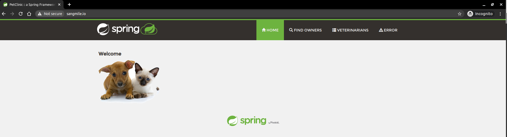

# DevOps 사전 과제
### 과제 내용
웹 어플리케이션 spring-petclinic-data-jdbc을 kubernetes 환경에서 실행하고자 합니다.
- 요구 사항에 부합하도록 빌드 스크립트, 어플리케이션 코드, kubernetes에 배포하기 위한 파일을 작성

## 설정 내용
---
### 1. 구성 환경
- Ubuntu 18.04
- git version 2.17.1
- java
    ```
    openjdk version "11.0.9.1" 2020-11-04
    OpenJDK Runtime Environment (build 11.0.9.1+1-Ubuntu-0ubuntu1.18.04)
    OpenJDK 64-Bit Server VM (build 11.0.9.1+1-Ubuntu-0ubuntu1.18.04, mixed mode, sharing)
    ```
- Gradle 6.3
- docker 19.03.13
- minikube v1.15.1

### 2. 프로젝트 실행 방법
#### 2.1 사전 작업
- 도커 로그인   
Docker hub에 도커 이미지를 업로드하기 위해 로그인합니다.
```bash
$ docker login

Username: <YOUR_DOCKERHUB_USERNAME>
Password: <YOUR_DOCKERHUB_PASSWORD>
```

- 레포지토리 생성   
[Docker Hub](https://hub.docker.com/repositories)에서 **petclinic** 이름으로 레포지토리를 생성합니다.

#### 2.2 빌드
- 소스 다운로드 및 디렉토리 이동
```bash
$ git clone https://github.com/sangmile/petclinic-devops.git
$ cd petclinic-devops
```

- `build.gradle` 파일 생성  
<YOUR_DOCKERHUB_USERNAME>를 DOCKERHUB에 로그인한 계정으로 대체합니다.
```bash
DOCKERHUB_USERNAME=<YOUR_DOCKERHUB_USERNAME>
envsubst < template/build.gradle.template > build.gradle
```

- 빌드 후 도커 이미지 생성 및 업로드
```bash
$ ./gradlew clean docker dockerTagDockerHub dockerPushDockerHub
```

### 2.3 배포
- host에 /logs 디렉토리 생성
```bash
$ minikube ssh

docker@minikube:~$ mkdir /logs
```

- `nginx-ingress-controller` 배포
```bash
$ minikube ssh
$ minikube addons enable ingress
```

- `app-deploy.yaml` 파일 생성
```bash
$ envsubst < template/app-deploy.yaml.template > kubernetes/app-deploy.yaml
```

- `app-ingress.yaml` 파일 생성
```bash
$ envsubst < template/app-ingress.yaml.template > kubernetes/app-ingress.yaml
```

- 리소스 배포
```bash
$ kubectl apply -f kubernetes/
```

### 2.4 확인
- `/etc/hosts` 파일 수정
```bash
root# echo "$(minikube ip) ${DOCKERHUB_USERNAME}.io" >> /etc/hosts
```

- 브라우저 접속 확인    
`http://<YOUR_DOCKERHUB_USERNAME>.io`


## 요구사항 적용 내용
---
1. gradle을 사용하여 어플리케이션과 도커이미지 빌드한다.
    - `palantir` plugin 설정 후 아래 명령어 실행
    ```
    $ ./gradlew docker
    ```

2. 어플리케이션의 log는 host의 /logs 디렉토리에 적재한다.
    - `src/main/resources/application.properties` 파일 내 `logging.file.path=logs` 설정
    - `kubernetes/app-deploy.yaml` 파일 내 `volume` 관련 설정
    - 컨테이너 `/logs` 디렉토리를 host의 `/logs` 디렉토리에 마운트

3. 정상 동작 여부를 반환하는 api를 구현하며, 10초에 한번 체크하도록 한다. 3번 연속 체크에 실패하면 어플리케이션은 restart 된다.
    - `src/main/resources/application.properties` 파일 내 `Actuator` 설정
    - `kubernetes/app-deploy.yaml` 파일 내 `livenessProbe` 설정

4. 종료 시 30초 이내에 프로세스가 종료되지 않으면 SIGKILL로 강제 종료 시킨다.
    - `kubernetes/app-deploy.yaml` 파일
    ```yaml
        terminationGracePeriodSeconds: 30
    ```

5. 배포 시와 scale in/out 시 유실되는 트래픽이 없어야 한다.
    - `kubernetes/app-deploy,yaml` 파일 내 `strategy` 설정

6. 어플리케이션 프로세스는 root 계정이 아닌 uid:1000으로 실행한다.
    - `Dockerfile` 파일 내 `user` 관련 설정
    ```Dockerfile
    RUN useradd -u 1000 spring
    USER spring
    ```

7. DB도 kubernetes에서 실행하며 재 실행 시에도 변경된 데이터는 유실되지 않도록 설정한다.
    - `kubernetes/mysql-deploy.yaml` 파일: mysql 실행
    - `kubernetes/mysql-pv-volume.yaml` 파일: Persistent Volume 생성
    - `kubernetes/mysql-deploy.yaml` 파일: PVC 및 Volume 마운트

8. 어플리케이션과 DB는 cluster domain을 이용하여 통신한다.
    - `src/main/resources/application.properties` 파일
    ```conf
    spring.datasource.url=jdbc:mysql://mysql.default.svc.cluster.local:3306/petclinic
    ```

9. nginx-ingress-controller를 통해 어플리케이션에 접속이 가능하다.
    - `kubernetes/app-ingress.yaml` 파일

10. namespace는 default를 사용한다.
    - `namespace`: default

11. README.md 파일에 실행 방법을 기술한다.
